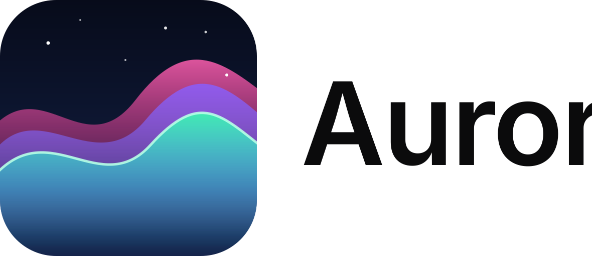
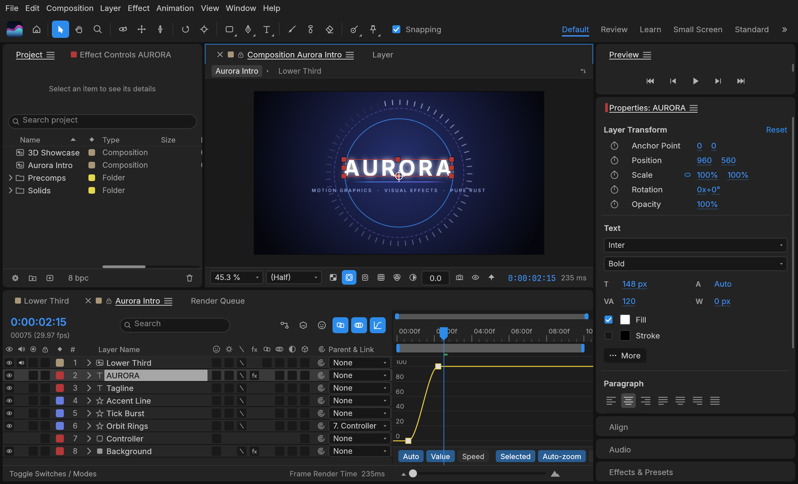
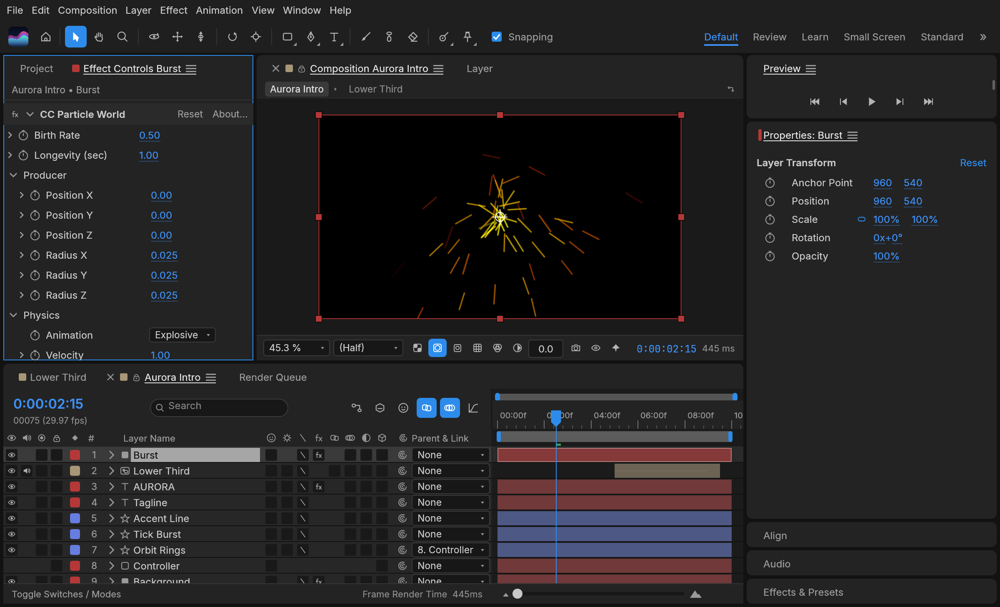
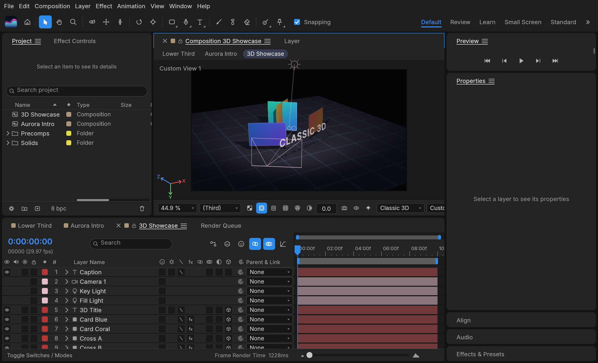

<p align="center">
  <picture>
    <source media="(prefers-color-scheme: dark)" srcset="docs/brand/aurora-logo-white.svg">
    
  </picture>
</p>


<h1 align="center">Aurora</h1>

<p align="center">
  <b>Motion graphics and visual effects; an open-source, clean-room reimplementation of Adobe After Effects, rebuilt in pure Rust.</b>
</p>

<p align="center">
  A free, open-source compositor in the spirit of After Effects: compositions, layers,
  keyframes, 306 effects, layer styles, expressions, 3D cameras and lights, and a render queue, native on macOS,
  Windows and Linux, and in the browser. Young, moving fast, and already usable.
</p>

<p align="center">
  
  
  
</p>

<br>

<p align="center">
  
</p>

<p align="center">
  <a href="#what-aurora-is">What it is</a> ·
  <a href="#animate">Animate</a> ·
  <a href="#effects">Effects</a> ·
  <a href="#3d">3D</a> ·
  <a href="#export">Export</a> ·
  <a href="#built-for-agents">Agents</a> ·
  <a href="#get-started">Get started</a> ·
  <a href="#where-it-stands">Status</a> ·
  <a href="#how-its-made">How it's made</a> ·
  <a href="#license-and-credits">License</a>
</p>

## What Aurora is

Aurora is for animated titles, motion graphics and compositing work: the kind of thing
people reach for After Effects to do. You build a composition out of layers (solids, shapes,
text, footage, other compositions), animate their properties with keyframes, stack effects on
them and render the result.

The aim is to feel familiar to anyone who has used After Effects, with the same panels (Project,
Composition, Timeline, Effect Controls, Effects & Presets) and the same keyframe behaviour, and
then to go further in a few places where it matters to us:

- **Lottie import and export built in**, so animations can go straight to the web and apps
  without a plugin.
- **A project file you can read.** Projects are versioned JSON (`.ecproj`), so they diff cleanly
  in version control.
- **Everything is scriptable.** Every menu item, timeline drag and property edit goes through one
  command registry, so the same actions are reachable from a command line, a JSON control
  channel and an MCP server for agents.
- **No FFmpeg.** Video and audio decoding and encoding are pure Rust: FilmCraft's codecs and
  Aurora's own VP9, AV1, HEVC and Opus encoders.

## Animate

The panels, menus and shortcuts follow After Effects, so your muscle memory carries over:
Project, Composition, Timeline, Effect Controls, Properties, Effects & Presets, Character,
Paragraph, Align, Info, Preview, Audio and the Render Queue, docked the way you expect. Drag
footage, comps and effects between them: onto the comp viewer, where they land under the pointer,
or into the Timeline, between layers and at the time you point to.

- **Layers of every kind:** solids, shapes, text, footage, nested compositions, nulls,
  adjustment layers, cameras and lights; parenting, track mattes, all 38 blend modes, motion blur.
- **Keyframes that behave the same:** linear, Bezier, hold, auto and continuous Bezier, roving
  keys, Easy Ease (F9), Keyframe Velocity and Interpolation dialogs, copy and paste at the current
  time, and a **Graph Editor** with value and speed graphs and draggable handles.
- **Time:** time remapping, time stretch, time-reverse, freeze frame, work area, markers, exact
  frame-accurate timing at every frame rate including 29.97 drop-frame.
- **Shapes and masks:** shape layers with trim paths, repeaters, round corners, offset, zig zag,
  twist, wiggle, merge paths and gradient strokes; masks drawn with the pen tool, with modes,
  feather, expansion and vertex editing in the viewer.
- **Text:** point and paragraph text with real shaping in any font installed on your machine, the
  Character and Paragraph panels, and text animators with range selectors.
- **Expressions:** JavaScript with the After Effects object model (`wiggle`, `loopOut`,
  `thisComp.layer("…")`, vector maths on arrays), an inline editor and the pick-whip.
- **Timeline like you know it:** twirl layers open to Transform, masks, effects and the rest; drag
  rows to reorder layers; rename with Enter or a double-click; the property shortcuts (A, P, S,
  R, T, M, F, E, L, U and their double presses AA, PP, SS, RR, TT, MM, FF, EE, LL, UU), Shift to
  add properties, Alt+Shift+A/P/S/R/T to key the current time, Ctrl+` to twirl selected layers.
- **Puppet tools:** Position, Advanced, Bend, Starch and Overlap pins on a mesh built from the
  layer, real-time pin recording, rotate/scale handles, pins driven by (or carrying) nulls for
  rigging, and follow-through for hair and cloth.

<p align="center">
  
</p>

## Effects

306 effects (every one of After Effects' 298, and more) across its categories, each with its parameter names, order and
defaults: blur and sharpen, channel, color correction (Curves, Levels, Hue/Saturation, Lumetri
Color…), distort (Warp, Bulge, Turbulent Displace, CC Power Pin…), generate (Fractal Noise,
Gradient Ramp, Stroke, Write-on, Audio Spectrum…), keying, matte, noise and grain, perspective,
**simulation** (CC Particle World, CC Rainfall, Shatter, Card Dance, Caustics, Wave World…),
stylize (Glow, CC Glass…), **time** (Echo, Posterize Time, Timewarp, Time Displacement…),
**audio** (Reverb, Parametric EQ, Delay, Stereo Mixer…), text, transitions, utility and expression
controls. All nine **Layer Styles** (Drop Shadow, Inner/Outer Glow, Bevel and Emboss, Satin,
overlays, Stroke) with Global Light. Preview plays audio in sync, with meters and waveforms.

<p align="center">
  
</p>

## 3D

Classic 3D the way After Effects does it: 3D layers with orientation and material options,
one- and two-node **cameras** with depth of field, **lights** (parallel, spot, point, ambient)
with soft ray-traced shadows, layers that intersect correctly, orbit, pan and dolly camera
tools, and Front, Top, Left and Custom views.

<p align="center">
  
</p>

## Export

A Render Queue like After Effects', with Render Settings and Output Modules: **H.264** MP4 and
**ProRes** MOV (Proxy to 4444 XQ with alpha) with audio, **HEVC** (Main / Main 10) and **AV1**
MP4, **WebM** (VP9 with inter frames and alpha, or AV1; Opus audio), PNG, JPEG, TIFF and 32-bit EXR sequences, animated GIF and WAV/AIFF. Field
rendering with 3:2 pulldown, effect/solo/guide/depth overrides, crop, region of interest and
resize, Render Settings and Output Module templates with defaults, post-render actions, storage
overflow and render logs. The same queue runs from the command line. Every encoder is pure
Rust (FilmCraft's H.264, ProRes and AAC; Aurora's own VP9, AV1, HEVC and Opus); there is no
FFmpeg inside.

**Lottie** goes both ways: File ▸ Export ▸ Lottie JSON… writes a composition (precomps, shape,
solid, image, text and null layers, eased and spatial keyframes, masks, track mattes, blend
modes, time remapping, optionally expressions) as `.json` or `.lottie`, and lists anything Lottie
cannot express; File ▸ Import ▸ Lottie… opens one as a new composition.

<p align="center">
  
</p>

## Built for agents

Everything you can do from a menu is a command with an id, and agents can reach every one of
them:

- **MCP server:** `aurora-cli mcp` speaks the Model Context Protocol over stdio, headless
  or bridged to the running app (`--bridge 9877`). Tools cover commands, the project and property
  tree, keyframes and rendered frames. This repository ships a ready [`.mcp.json`](.mcp.json).
- **Command line:** one-shot calls with JSON output, for example
  `aurora-cli set Main '#1' transform/position '[100,360]' --time 0 main.ecproj --save`
  or `aurora-cli render --comp Main --out main.mp4`, or
  `aurora-cli exec file.exportLottie '{"comp":"Main","path":"main.json"}' main.ecproj`.
- **Control channel:** `aurora --control 9877` accepts JSON lines to run commands, inspect
  and click any widget by its automation id, and take screenshots.

See [docs/agents.md](docs/agents.md) and [docs/control-protocol.md](docs/control-protocol.md).

## Get started

Installers for each version are on the [Releases](https://github.com/jaerasgon/aurora/releases)
page: a universal macOS app; Windows MSIs and portable zips for x64, x86 and ARM64; and Linux
AppImage, deb, rpm and tar.gz for x86_64 and aarch64. The Windows ARM64 build runs natively on
Windows on ARM, without x64 emulation. CI installs that MSI on Windows 11 ARM64 hardware, checks
both programs are ARM64 and runs the command-line tool there, but it doesn't open the app's window
or run the test suite natively on ARM64 yet, so please report anything that behaves differently.

To build it yourself you need [Rust](https://rustup.rs/) 1.95 or newer.

```sh
git clone https://github.com/jaerasgon/aurora
cd aurora
cargo run --release -p aurora          # the app (add `-- --demo` to open the demo project)
cargo run --release -p aurora-cli -- render --out intro.mp4    # render the demo headless
cargo xtask web --serve 8765                # the browser build on http://127.0.0.1:8765/ (docs/web.md)
```

To work on it: `cargo test --workspace`, and `cargo xtask ci` before every commit (format, lints,
tests, layering, asset attribution and the WebAssembly build). See [CONTRIBUTING.md](CONTRIBUTING.md),
[docs/architecture.md](docs/architecture.md) and [docs/testing.md](docs/testing.md).

## Where it stands

Aurora is young: its first commit was on 1 October 2026. Nearly every After Effects feature
exists, including all of its effects, but existing is not the same as behaving exactly like After
Effects, and we haven't measured that yet. Today it's a good place to try things and to tell us
what breaks. It isn't yet a replacement for After Effects on client work. In particular:

- **After Effects projects can't be opened.** Projects are saved as `.ecproj`, readable versioned
  JSON, but Aurora can't open `.aep` / `.aepx` files, and After Effects plug-ins don't run.
- **Behaviour still differs from After Effects in places.** Nothing yet compares our renders with
  After Effects automatically, so please report differences.
- **macOS is the most tested platform.** Linux and Windows users have hit basic interaction
  bugs, which we're fixing first.
- **The trained models are new.** Roto Brush can use MobileSAM (an optional 40 MB download in
  Settings ▸ Roto Brush) and face tracking can use Google's MediaPipe Face Landmarker (an optional
  3.8 MB download in Settings ▸ Face Tracking). Neither is compared with After Effects yet.

The [ROADMAP](ROADMAP.md) has the plan and [docs/gaps.md](docs/gaps.md) the full, honest
assessment. The web build ([docs/web.md](docs/web.md)) runs the full app in the browser.
[Bug reports](https://github.com/jaerasgon/aurora/issues) are the most useful thing you can
send us right now.

## How it's made

- **Engine first.** A stack of small crates with strict layering. The interface (egui) sits on
  top and nothing underneath depends on it.
- **Clean room.** We work from After Effects' public documentation and how it behaves, never
  from Adobe's files, icons, presets or code. No code is copied from GPL projects. The full rules
  are in [AGENTS.md](AGENTS.md).
- **Private by default.** No telemetry, and no network access unless you ask for it.
- **Built on FilmCraft.** Aurora shares its time model and text engine design with FilmCraft, and
  gets its video and audio codecs from it.

## License and credits

Aurora is dual-licensed under [MIT](LICENSE-MIT) or [Apache-2.0](LICENSE-APACHE), at your option.
Copyright (c) 2026 Jaerasgon. Aurora is a fork of [EffectCraft](https://github.com/storytold/effectcraft); the original copyright
(c) 2026 ArtCraft Team and the EffectCraft contributors stays on the code it covers. Required notices are in [NOTICE](NOTICE).

Bundled fonts, icons, images and other assets keep their own open licenses; each one is listed
with its author, source and license in [ATTRIBUTION.md](ATTRIBUTION.md).

The Aurora name and logos in [`docs/brand/`](docs/brand/) are original work under the same license.

<sub>Adobe, Photoshop, Illustrator, Premiere Pro, Lightroom, Acrobat, After Effects and InDesign are trademarks or registered trademarks of Adobe Inc. in the United States and/or other countries. Aurora is an independent, open-source project and is not affiliated with, sponsored by or endorsed by Adobe Inc.; these names are used only to describe the workflows it is compatible with.</sub>

## Star history

[](https://www.star-history.com/?repos=jaerasgon%2Faurora&type=date&legend=top-left)
